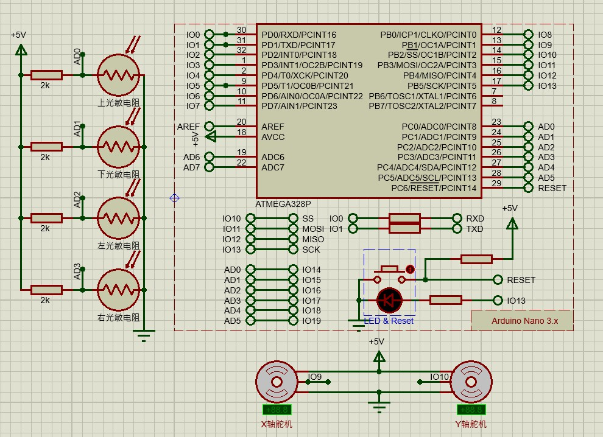

# 基于PID调节的（弱智）追光系统
使用光敏电阻+180°舵机+Arduino+PID调节器，实现了一个简单的立体角追光系统。  
开发环境：Arduino IDE 1.8.16
## 注意事项
由于传感器的线性度可能较差，所以可能对于差距较大的光强条件下，需要重新校准光敏电阻的输出和PID参数。  
串口通讯的波特率为115200，数据位为8，停止位为1，无校验位。  
舵机转动时由于立体角使用的欧拉角结构，可能会发生“万向死锁”的现象，所以在使用时需要注意舵机的转动角度。
## 特点
- 有较完备的串口指令功能，可以通过串口发送指令修改参数、调试和开关某个功能，若增加蓝牙模块连接对应的串口并开发对应的APP，即可以使用手机远程控制
- 通过指令修改的参数可以持久保存在EEPROM中，断电不丢失
## 原理图

## 指令说明
### 指令列表
- `- %d`：直接设置舵机水平方向角度，返回设置后的水平方向角度
- `| %d`：直接设置舵机垂直方向角度，返回设置后的垂直方向角度
- `#`：返回当前运行状态（舵机角度，水平/垂直自动调节状态，调试模式状态）
- `H`：开启/关闭水平方向自动调节，返回当前水平方向自动调节状态
- `V`：开启/关闭垂直方向自动调节，返回当前垂直方向自动调节状态
- `!`：开启/关闭调试模式，返回当前调试模式状态（调试模式下，会在串口输出每隔1秒输出一次当前各光敏电阻的输出值和水平与垂直方向的误差）
- `D %f %f`：设置下光敏电阻的校准参数，返回设置后的下光敏电阻的校准参数
- `R %f %f`：设置右光敏电阻的校准参数，返回设置后的右光敏电阻的校准参数
- `X %f %f %f`：设置水平方向PID参数，返回设置后的水平方向PID参数
- `Y %f %f %f`：设置垂直方向PID参数，返回设置后的垂直方向PID参数
- `T %d`：设置光照阈值，返回设置后的光照阈值
- `P`：返回当前使用的参数（下、右光敏电阻校准值，PID参数，光照阈值）
- `S`：保存当前使用的参数到EEPROM中，返回"Saved"字符串消息
- `C`：清除EEPROM中保存的参数，并立即重启（会恢复所有参数为默认值），返回"Cleared, restarting..."字符串消息
### 指令格式
指令发送格式为：`<指令标志> <参数>`，其中指令标志为一个字符，参数为一个或多个数字，参数之间用一个或多个空格或者逗号等（不可为".+-e"中的任意一个字符）分隔。例如："X 0.01, 0.0002, 0.01"。  
其中"%d"表示需要输入一个整数，"%f"表示需要输入一个浮点数。  
  
指令返回格式为压缩的JSON格式，方便用代码解析。

